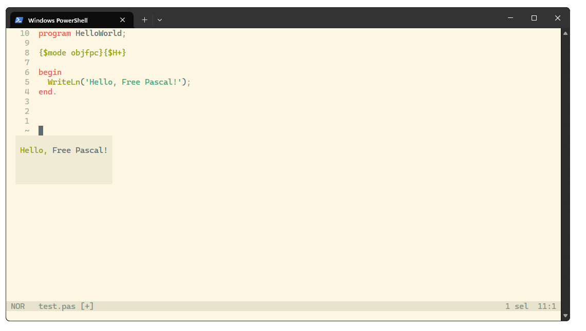
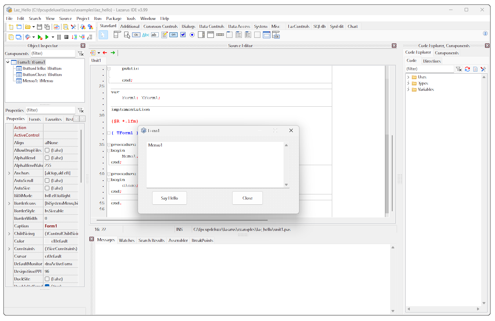
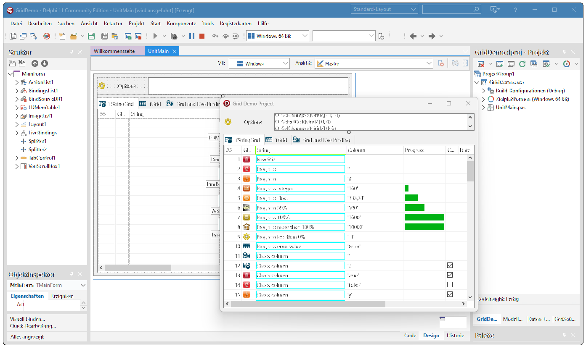

import Tabs from '@theme/Tabs';
import TabItem from '@theme/TabItem';
import MDXComponents from '@theme-original/MDXComponents';
import { Icon } from '@iconify/react';
import styles from './style.css';

# Download

:::info
This is a simple comparison, not everything is covered!
Contribute to this page https://github.com/Delphi-Community/Delphi-Community-Page
:::

| Features | <a href="#free-pascal">Free Pascal</a> | <a href="#lazarus">Lazarus</a> | <a href="#delphi">&nbsp;&nbsp;&nbsp;&nbsp;Delphi&nbsp;&nbsp;&nbsp;&nbsp;</a> |
|:------------------------------------------------------------| :-----------: | :-------: | :-----: |
| IDE Platform Support | <Icon icon="codicon:terminal-linux" /> <Icon icon="wpf:macos" /> <Icon icon="fontisto:windows" /> <Icon icon="simple-icons:arm" /> | <Icon icon="codicon:terminal-linux" /> <Icon icon="wpf:macos" /> <Icon icon="fontisto:windows" /> | <Icon icon="fontisto:windows" /> |
| Target Platform Support | <Icon icon="codicon:terminal-linux" /> <Icon icon="wpf:macos" /> <Icon icon="fontisto:windows" /> <Icon icon="simple-icons:arm" /> | <Icon icon="codicon:terminal-linux" /> <Icon icon="wpf:macos" /> <Icon icon="fontisto:windows" /> | <Icon icon="codicon:terminal-linux" /> <Icon icon="wpf:macos" /> <Icon icon="fontisto:windows" /> <Icon icon="ant-design:android-filled" /> <Icon icon="simple-icons:ios"/>|
| Free  | <Icon icon="fa:check" color="#00d26a" /> | <Icon icon="fa:check" color="#00d26a" /> | <Icon icon="fa:check" color="#ff6723" /> ¹ |

🟩 available;
🟧 limited;
🟥 not available;

¹ [not exceed USD $5,000.00](https://www.embarcadero.com/products/rad-studio/rad-studio-eula#ce-terms) 

---

## Free Pascal



Free Pascal, commonly known as FPC, is a free and open-source compiler for Pascal and Object Pascal languages.
Developed initially in the 1990s, it is designed for cross-platform compatibility, supporting various operating systems like Windows, macOS, and Linux.
FPC is compatible with Borland Turbo Pascal and Delphi, which makes it appealing for developers transitioning from these environments.
It is known for generating efficient, optimized code and supports modern Pascal features like generics and advanced object-oriented programming.
Free Pascal is often paired with the Lazarus IDE, a robust environment for developing cross-platform GUI applications.
The active community around Free Pascal contributes to its continuous improvement, offering extensive documentation and support, making it a practical choice for both beginners and experienced Pascal programmers.

### Download Free Pascal

<Tabs groupId="operating-systems"> 
  <TabItem value="linux" label="Linux">
    ```sh
      curl --proto '=https' --tlsv1.2 -sSf https://sh.delphi-community.com | sh
    ```
  </TabItem>
  <TabItem value="win" label="Windows">
    Free Pascal
    ```sh
      winget install freepascal
    ```
  </TabItem>
  <TabItem value="mac" label="macOS">
    ```sh
      curl --proto '=https' --tlsv1.2 -sSf https://sh.delphi-community.com | sh
    ```
  </TabItem>
</Tabs>

---

## Lazarus




Lazarus IDE is a free, open-source development environment for Pascal programming.
Notable for its compatibility with Delphi, Lazarus enables cross-platform application development for Windows, macOS, and Linux.
It features a user-friendly form designer for easy GUI creation and integrates seamlessly with the Free Pascal compiler.
Lazarus is equipped with debugging tools and boasts an active community, making it accessible and continually evolving, ideal for both beginners and experienced developers.

### Download Lazarus
<Tabs groupId="operating-systems"> 
  <TabItem value="linux" label="Linux">
    ```sh
      curl --proto '=https' --tlsv1.2 -sSf https://sh.delphi-community.com | sh
    ```
  </TabItem>
  <TabItem value="win" label="Windows">
    Lazarus (IDE) and Free Pascal
    ```sh
      winget install lazarus
    ```
  </TabItem>
  <TabItem value="mac" label="macOS">
    ```sh
      curl --proto '=https' --tlsv1.2 -sSf https://sh.delphi-community.com | sh
    ```
  </TabItem>
</Tabs>

---

## Delphi



Delphi is a robust integrated development environment (IDE) primarily used for developing desktop, mobile, web, and console applications.
Renowned for its rapid application development capabilities, Delphi utilizes the Object Pascal language, offering a blend of high productivity and performance.
It provides a rich set of tools including a visual designer, an advanced code editor, and powerful debugging tools.
Delphi stands out for its ability to create high-performance applications with a native user experience across multiple platforms.
Its user-friendly interface and comprehensive component libraries make it popular among developers for creating visually appealing and database-intensive applications.
Delphi's long-standing presence in the software development world has fostered a strong community and a wealth of third-party components, enhancing its versatility and appeal.

### Download Delphi
To download Delphi, you have two options.
You can purchase it from Embarcadero's official website at https://embarcadero.com.
Alternatively, if you're looking for a no-cost version, you can opt for the Community Edition, which is available for download at https://www.embarcadero.com/de/products/delphi/starter. This Community Edition is ideal for individuals or small organizations.